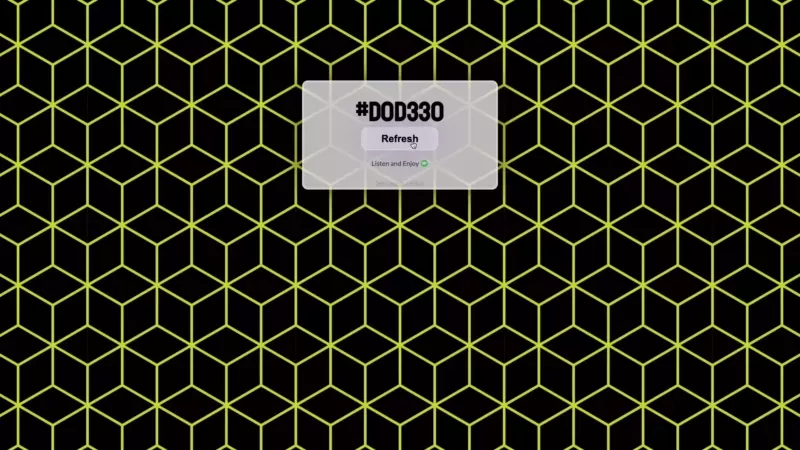

# Magic Color XXL
What started as a random hex color generator, a class project at [BocaCode](https://bocacode.com), turned into a fun experimental site while jamming to music ([Spotify playlist](https://open.spotify.com/playlist/4RuO5yX4bziAqTYEc3EM4w?si=6ffa673a347848ad)).

* [👉 magic-color-xxl.web.app](https://magic-color-xxl.web.app/)
* [👉 Youtbe](https://www.youtube.com/watch?v=fIWf74r5cnE)

# Sources
I got the background patterns from below.
* [FreePik.com](https://www.freepik.com/free-photos-vectors/seamless-pattern)
* [Vecteezy.com](https://www.vecteezy.com/png/1209782-square-pattern)